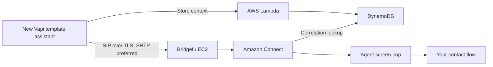

# Bridgefu: Vapi transfers to Amazon Connect

Bridgefu receives a SIP transfer from a Vapi assistant, starts the call in your
existing Amazon Connect instance, and shows the receiving agent the small set
of caller details you chose to collect.

The stack creates a **new template Vapi assistant**. It never changes an
existing assistant. You customize the new assistant after deployment.

## Deploy

**[Deploy Vapi transfers to Amazon Connect](docs/deploy.md)**

You need:

- An active Amazon Connect instance and a published destination contact flow.
- A public Route53 hosted zone.
- A Vapi private API key stored in AWS Secrets Manager.
- An Amazon Connect instance in `us-west-2` or `us-east-1`.

CloudFormation creates the VPC, one Bridgefu EC2 gateway, DynamoDB, Lambdas,
Connect wrapper flows, alarms, and the Vapi template assistant. There is no
setup CLI, local web server, or desktop application.

Bridgefu is always deployed in the same region as the selected Connect
instance. If you are creating a new Connect instance for a Vapi US organization,
prefer **US West (Oregon)**: Vapi's published US SIP signaling addresses are in
AWS's Oregon region, avoiding an unnecessary cross-region leg.

## Release attestation

Release **v0.1.34** was built from distribution commit
[`30dcc7791af1b49f42da0b97be4dabb14fbd7582`](https://github.com/eisenzopf/bridgefu-vapi-awsconnect/commit/30dcc7791af1b49f42da0b97be4dabb14fbd7582)
and Bridgefu commit
[`e00db3289480f93c2783c57440a324e4438e29de`](https://github.com/eisenzopf/bridgefu/commit/e00db3289480f93c2783c57440a324e4438e29de).
Fresh disposable qualification stacks passed in both `us-west-2` and
`us-east-1` before publication.

Each region passed:

- A direct SIPS/TLS, `RTP/SAVP`, SDES-SRTP preflight.
- Browser Bridgefu Web SDK → Vapi → Bridgefu → Amazon Connect.
- rvoip SIP client → Vapi → Bridgefu → Amazon Connect.
- Correlation and stored context, agent screen pop, bidirectional audio, DTMF,
  source and agent hangup, restart-free runtime, and active-call CPU and memory
  below 60%.
- Destruction of the disposable stack and exact zero-resource proof.

The immutable, signed evidence is public:

- [Qualified-candidate receipt](https://bridgefu-vapi-awsconnect-225478700523-us-east-1.s3.us-east-1.amazonaws.com/releases/0.1.34/qualification/receipt.json)
  and [KMS signature](https://bridgefu-vapi-awsconnect-225478700523-us-east-1.s3.us-east-1.amazonaws.com/releases/0.1.34/qualification/receipt.sig)
- [Oregon evidence](https://bridgefu-vapi-awsconnect-225478700523-us-east-1.s3.us-east-1.amazonaws.com/releases/0.1.34/qualification/us-west-2/evidence.json)
- [Virginia evidence](https://bridgefu-vapi-awsconnect-225478700523-us-east-1.s3.us-east-1.amazonaws.com/releases/0.1.34/qualification/us-east-1/evidence.json)
- [Immutable customer CloudFormation template](https://bridgefu-vapi-awsconnect-225478700523-us-east-1.s3.us-east-1.amazonaws.com/releases/0.1.34/cloudformation/template.yaml)

This attestation applies only to the immutable v0.1.34 artifacts and commits
listed above. Later documentation changes do not change or requalify that
release.

## How the handoff stays bounded

The Vapi tool accepts only your configured screen-pop fields. Lambda creates
the correlation ID and stores those values before transfer. Vapi places the
correlation header in its SIP INVITE; Bridgefu passes it to Connect; the
Connect lookup Lambda reads DynamoDB and populates the agent screen. The model
never sees credentials, the correlation ID, or the one-time SIP route.

See [operations](docs/operations.md) and the [alarm runbooks](runbooks/README.md)
for monitoring, recovery, updates, retention, and removal. Maintainers should
begin with [the release guide](docs/maintainers/release.md).
