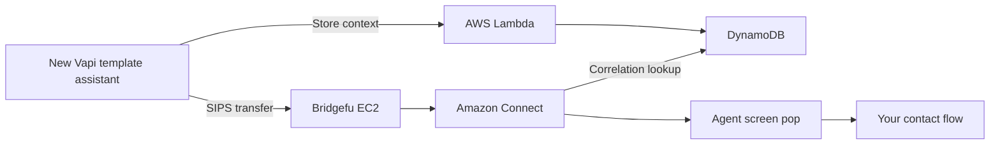

# Bridgefu: Vapi transfers to Amazon Connect

Bridgefu receives a SIP transfer from a Vapi assistant, starts the call in your
existing Amazon Connect instance, and shows the receiving agent the small set
of caller details you chose to collect.

The stack creates a **new template Vapi assistant**. It never changes an
existing assistant. You customize the new assistant after deployment.

## Deploy

**[Deploy Vapi transfers to Amazon Connect](docs/deploy.md)**

You need:

- An active Amazon Connect instance and a published destination contact flow.
- A public Route53 hosted zone.
- A Vapi private API key stored in AWS Secrets Manager.
- `us-east-1` or `us-west-2` for the first release.

CloudFormation creates the VPC, one Bridgefu EC2 gateway, DynamoDB, Lambdas,
Connect wrapper flows, alarms, and the Vapi template assistant. There is no
setup CLI, local web server, or desktop application.

## How the handoff stays bounded

The Vapi tool accepts only your configured screen-pop fields. Lambda creates
the correlation ID and stores those values before transfer. Vapi places the
correlation header in its SIP INVITE; Bridgefu passes it to Connect; the
Connect lookup Lambda reads DynamoDB and populates the agent screen. The model
never sees credentials, the correlation ID, or the one-time SIP route.

See [operations](docs/operations.md) for monitoring, updates, retention, and
removal. Maintainers should begin with [the release guide](docs/maintainers/release.md).

